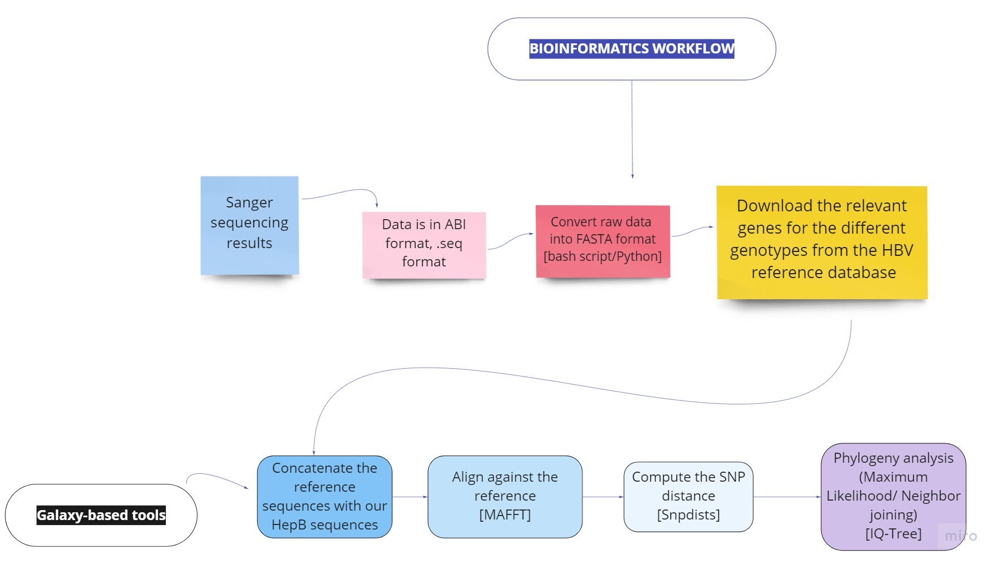

# In silico Analysis of the Single Nucleotide Polymorphisms (SNPs) of Human Hepatitis **B** and **D** Viruses in Sudan

## Background
Hepatitis B virus (HBV) is a partial double-stranded DNA virus of the Hepadnaviridae family, which have some of the smallest known viral genomes. The HBV genome is 3.2 kb with multiple overlapping reading frames. It is a has very high substitution rate, especially for a DNA virus.  As a result of nucleic acid sequence variation, there are nine recognized HBV genotypes (A to I) and one putative genotype (J), which have distinct geographical distributions. HBV genotypes influence clinical outcomes, long-term complications, response to treatment and even routes of transmission of infection.

## Data sources
* HBVdb - hepatitis B - https://hbvdb.lyon.inserm.fr/HBVdb/HBVdbDataset
* NCBI genotyping tool: https://www.ncbi.nlm.nih.gov/projects/genotyping/formpage.cgi
* HDVdb - hepatitis D - https://hdvdb.bio.wzw.tum.de/hdvdb/
## Workflow
1. Download the relevant genes for the different genotypes from the HBVdb
2. Combine (concatenate) the reference sequences with the sequenced gene sequences
3. Run multiple sequence alignment (mafft)
4. Compute SNP distances (snpdists) and phylogeny (iqtree)

## Pipeline 
1. Data preprocessing
* Converting **seq** files into **fasta** files.
* Quality control check (if needed).
2. Alignment
* minimap
* bwa-mem
* mafft
3. Compute SNPs distance
* snpdists
4. Phylogeny analysis
* Maximum likelihood 
* Neighbor joining. 
* IQ-tree

## Team members:
- Osama Mohammed
- Sabah Ibrahim
- Sumaya Kambal
- Esra A. Abdalwhab
- Arwa Ibrahim
- Sowole Adekunle Damilola
- Yagoub Adam 
- Situma Victor Wekesa
- Sofia B. Mohamed
